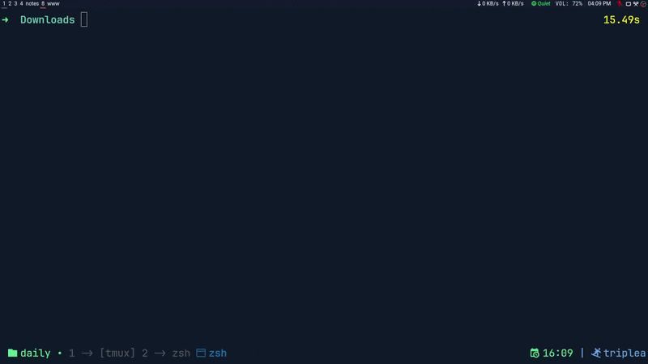

# shelf ツ

Terminal UI for managing CTF and box workspaces. Organizes a lab directory structure and spawns a tmux session for the selected target.

<p align="center"></p>

## Modes

| Mode | Structure |
|------|-----------|
| `ctf` | `$SHELF_BASE_DIR/training/challenges/<platform>/<category>/<challenge>` |
| `box` | `$SHELF_BASE_DIR/training/boxes/<platform>/<box>` |

`$SHELF_BASE_DIR` defaults to `~/work`. Directories are created automatically on selection — nothing needs to exist upfront. In CTF mode, selecting an empty platform prompts to generate default categories.

## Requirements

- Linux
- `tmux` (or any tool configured via `cmd`)

## Build

Produces a static `linux/amd64` binary, compressed with `upx` if available.

```bash
./build.sh
```

## Usage

```bash
shelf        # select mode interactively
shelf ctf    # launch in CTF mode
shelf box    # launch in box mode
```

Set `$SHELF_BASE_DIR` to override the default workspace root (`~/work`).

## Configuration

Config is auto-created at `~/.config/shelf/config.yaml` on first launch.

| Field | Description | Default |
|-------|-------------|---------|
| `primary_color` | Accent color (hex) | `#7aa2f7` |
| `secondary_color` | Background color (hex) | `#1a1b26` |
| `cmd` | Command to run after selecting a directory | `xdg-open $path` |

`$session` and `$path` are substituted with the directory name and full path respectively.

**tmux example:**

```yaml
cmd: "tmux new-session -ds $session -c $path 2>/dev/null; tmux switch-client -t $session 2>/dev/null || true"
```

## Keybindings

| Key | Action |
|-----|--------|
| `↑` `↓` `j` `k` | Navigate |
| `enter` | Select |
| `esc` | Go back |
| `/` | Filter current list |
| `ctrl+f` | Search all directories from current level |
| `n` | Create new entry |
| `r` | Rename entry |
| `d` | Delete entry |
| `q` | Quit |

